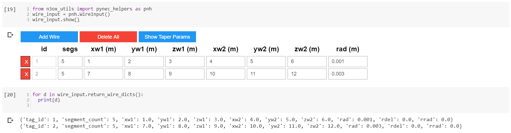

# `n3ox_utils` 

## N3OX Python Utilities

This is a personal package of Python utilities for antennas and transmission lines by N3OX.

## Contents
 * `nfanim`: Near-field animations using 
 [`PyNEC`](https://github.com/tmolteno/python-necpp/tree/master/PyNEC) NEC-2++ simulations.
 
 * `tlcalc`: Lossy transmission line calculations.

 * `pynec_helpers`: Wire input GUI and other helper utilities for working with [`PyNEC`](https://github.com/tmolteno/python-necpp/tree/master/PyNEC)

 ## `pynec_helpers` 

 